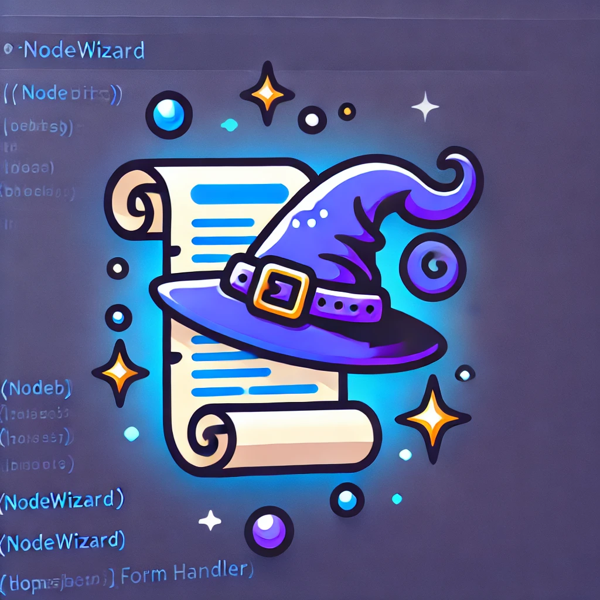

# NodeWizard



**NodeWizard** is a lightweight, dynamic, node-based flow handler for JavaScript applications. It is designed for creating multi-step forms, guided wizards, and any application that requires conditional step-by-step navigation.

## Features

- Flexible node-based flow system.
- Dynamic transitions based on custom conditions.
- Fully state-driven for handling complex flows.
- Lightweight and framework-agnostic.

---

## Installation

```bash
npm install nodewizard
```

## Getting Started
1. Define Your Flow Nodes
A flow consists of nodes (steps) and transitions (connections). Each node includes:

- A label for identification.
- An array of transitions, each specifying:
- The target node to navigate to.
- A condition function to determine if the transition is valid.
```javascript
const formNodes = {
  step1: {
    label: "Step 1",
    transitions: [
      { target: "step2", condition: (state) => state.option === "next" },
      { target: "step3", condition: (state) => state.option === "skip" },
    ],
  },
  step2: {
    label: "Step 2",
    transitions: [{ target: "step4", condition: () => true }],
  },
  step3: {
    label: "Step 3",
    transitions: [{ target: "step4", condition: () => true }],
  },
  step4: {
    label: "Step 4",
    transitions: [],
  },
};
```

2. Initialize NodeWizard
Create an instance of NodeWizard with the nodes and the starting node.

``` javascript
const NodeWizard = require("nodewizard");

const flow = new NodeWizard(formNodes, "step1");

```

3. Update State and Navigate
The flow transitions are driven by state. Update the state and move through the flow using next().

```javascript
// Update the state
flow.updateState("option", "next");

// Check the current node
console.log(flow.getCurrentNode()); // Outputs: step1

// Navigate to the next node
flow.next();
console.log(flow.getCurrentNode()); // Outputs: step2
```

You can also manually jump to any node using goTo():

```javascript
flow.goTo("step3");
console.log(flow.getCurrentNode()); // Outputs: step3
```
## API Reference
new NodeWizard(nodes, startNode)
```Creates a new flow handler.```

- nodes (object): The flow definition, where keys are node IDs and values define transitions.
- startNode (string): The ID of the initial node.

## Methods
```updateState(key, value)```
Updates the internal state of the flow.

- key (string): The state key to update.
- value (any): The value to set for the key.

```getState()```
Returns the current state object.

```getCurrentNode()```
Returns the ID of the current node.

```next()```
Navigates to the next node based on the transitions in the current node and the current state.

Throws an error if no valid transition is found.
```goTo(nodeId)```
Manually navigates to the specified node.

- nodeId (string): The ID of the target node.
- Throws an error if the node does not exist.

## Example: Multi-Step Form
Here’s an example of using NodeWizard in a React component:

```javascript
import React, { useState } from "react";
import NodeWizard from "nodewizard";

const formNodes = {
  step1: {
    label: "Step 1",
    transitions: [
      { target: "step2", condition: (state) => state.option === "next" },
      { target: "step3", condition: (state) => state.option === "skip" },
    ],
  },
  step2: {
    label: "Step 2",
    transitions: [{ target: "step4", condition: () => true }],
  },
  step3: {
    label: "Step 3",
    transitions: [{ target: "step4", condition: () => true }],
  },
  step4: {
    label: "Step 4",
    transitions: [],
  },
};

const NodeWizardForm = () => {
  const [flow] = useState(new NodeWizard(formNodes, "step1"));
  const [formState, setFormState] = useState({});
  const [currentNode, setCurrentNode] = useState(flow.getCurrentNode());

  const handleNext = (option) => {
    flow.updateState("option", option);
    try {
      flow.next();
      setCurrentNode(flow.getCurrentNode());
    } catch (err) {
      console.error(err.message);
    }
  };

  return (
    <div>
      <h1>{formNodes[currentNode].label}</h1>
      {currentNode === "step1" && (
        <>
          <button onClick={() => handleNext("next")}>Next</button>
          <button onClick={() => handleNext("skip")}>Skip</button>
        </>
      )}
      {currentNode === "step4" && <p>🎉 Form Complete!</p>}
    </div>
  );
};

export default NodeWizardForm;
```

## Testing
NodeWizard includes unit tests powered by Jest.

Run Tests
```bash
npm test
```
Example Test
```javascript
const NodeWizard = require("nodewizard");

describe("NodeWizard", () => {
  it("initializes with the correct starting node", () => {
    const nodes = {
      step1: { transitions: [] },
    };
    const flow = new NodeWizard(nodes, "step1");
    expect(flow.getCurrentNode()).toBe("step1");
  });
});
```

## Contributing
Contributions are welcome! If you find a bug or have ideas for features, feel free to open an issue or submit a pull request.

## Support Me ☕
If you like my work and want to support me, you can buy me a coffee!  
[](https://paypal.me/rlamnea/5?country.x=GB&locale.x=en_GB)


## License
This project is licensed under the MIT License.